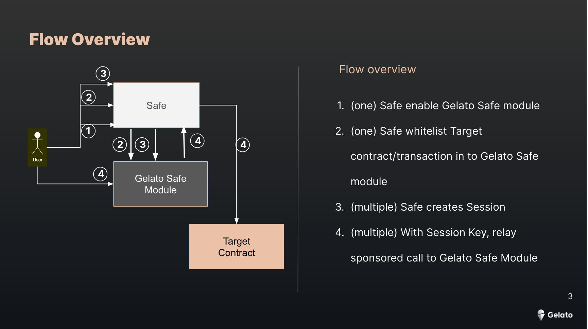

# Session Key UI
This project showcases how to use Session Keys to enable Signless Ux from a Safe.

## Web3 App
[https://safe-signless-trade.web.app](https://safe-signless-trade.web.app)

 

> **Note**  
> The Gelato Safe module is deployed on Goerli at [0xEBF7dc15b153601DdA7594DC7bC42105c1E06844](https://goerli.etherscan.io/address/0xEBF7dc15b153601DdA7594DC7bC42105c1E06844#code) and the counter contract at [0x87CA985c8F3e9b70bCCc25bb67Ae3e2F6f31F51C](https://goerli.etherscan.io/address/0x87CA985c8F3e9b70bCCc25bb67Ae3e2F6f31F51C)


When enabling Signless the webapp will:
- Check if there are already sessionkeys available in the browser
- Check if these keys are still vaild
- Create new session keysif needed
- Use session keys to sign following transactions 

Interesting code parts:
- Enabling Gelato Safe module within the Safe [here](/src/components/App/index.tsx#L696)
- Whitelist transaction [here](/src/components/App/index.tsx#L712)
- Creating session Keys [here](/src/components/App/index.tsx#L732)
- Signless Transaction [here](/src/components/App/index.tsx#L310)


 ## Get Started

Please add your sponsor key in here [here](/src/components/App/index.tsx#L55) :
```
  const GELATO_RELAY_API_KEY = "YOUR GELATO SPONSOR KEY";
```

 ```
 yarn start
 ```